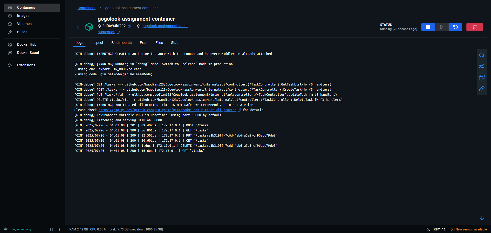

# Gogolook-assignment

Implement a RESTful task API application, which includes the following endpoints

```
GET /tasks
POST /tasks
PUT /tasks/{id}
DELETE /tasks/{id}
```

## Environment

- *go version go1.23.1*

## Dockerfile Location

The Dockerfile for this project is located at `build/dockerfile`

## Running with Docker

You can use the provided `build_and_run.sh` script to build and run the Docker container.

## Running Snapshot


